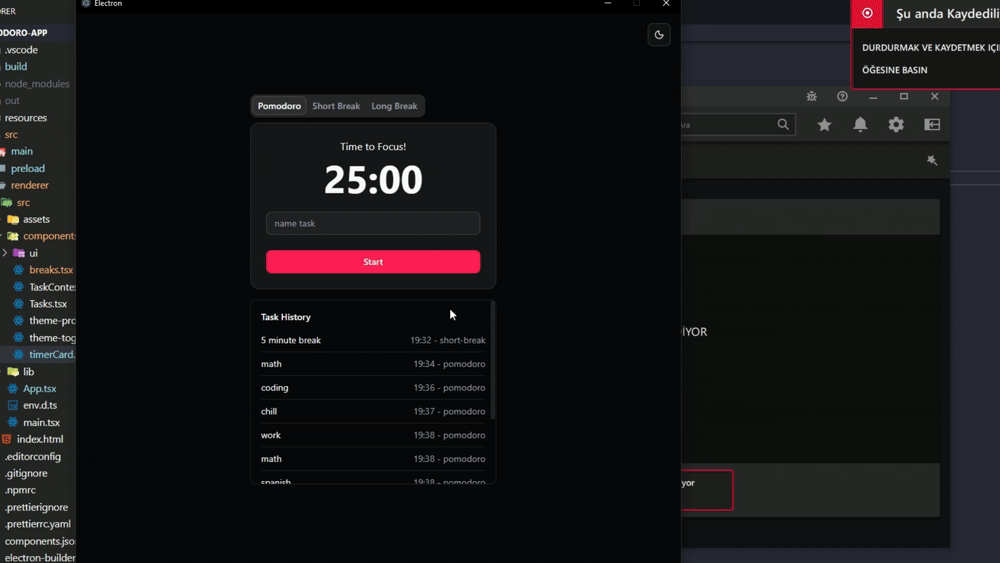

# Pomodoro-app

Pomodoro timer for productivity

# Features: 
- Clean UI
- Dark,Light mode
- Send Notification (uses Electron API)
# Demo



### 🛠 Tech Stack: 
- Electronjs
- Reactjs
- Typescript
- Tailwindcss
- Shadcn-ui (component library)

### Install
[Release page](https://github.com/utmp/pomodoro-app/releases)
### Build from source
If pnpm is not installed:
```bash
$ npm i -g pnpm
```
clone repo:
```bash
$ git clone https://github.com/utmp/pomodoro-app.git
cd pomodoro-app
```
Install deps:
```bash
$ pnpm install
```

### Development

```bash
$ pnpm dev
```
### Build

```bash
# For windows
$ pnpm build:win

# For macOS
$ pnpm build:mac

# For Linux
$ pnpm build:linux
```
